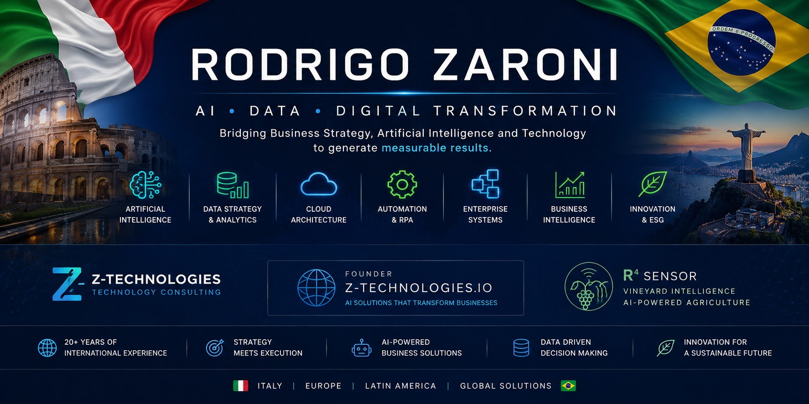

<p align="center">
  
</p>

<h3 align="center">
AI • Data • Digital Transformation • Enterprise Architecture
</h3>

<p align="center">
🇮🇹 Italian & 🇧🇷 Brazilian Citizen <br>
Digital Transformation Executive with 20+ years of international experience
</p>

---

# About Me

I help organizations transform business challenges into measurable results through:

- Artificial Intelligence
- Data Strategy & Analytics
- Digital Transformation
- Cloud Architecture
- Enterprise Systems
- Business Intelligence
- Process Automation
- Software Engineering

Throughout my career I have led multidisciplinary teams, enterprise transformation programs, ERP implementations, e-commerce platforms, AI initiatives and data-driven business strategies across Healthcare, Retail, Education, Manufacturing and Professional Services.

Today I operate at the intersection of business strategy, artificial intelligence and software engineering.

---

# Founder

### Z-Technologies.io

Technology consulting company focused on:

- AI Implementation
- Generative AI
- RAG Architectures
- Data Platforms
- Cloud Solutions
- Enterprise Automation
- Software Engineering
- Digital Transformation

---

# Current Focus

### Artificial Intelligence

- Generative AI
- Multi-Agent Systems
- RAG Platforms
- LLM Integration
- AI Automation

### Data & Analytics

- Data Strategy
- Data Warehousing
- Business Intelligence
- Predictive Analytics
- Machine Learning

### Architecture

- Enterprise Architecture
- Cloud Architecture
- API Ecosystems
- Microservices
- Event Driven Systems

### Innovation

- IoT
- Smart Agriculture
- Vineyard Intelligence
- ESG Data Solutions

---

# Featured Projects

## R⁴ Sensor

AI-powered vineyard intelligence platform combining:

- IoT Sensors
- BLE Communication
- Climate Analytics
- Machine Learning
- Wine Traceability
- Predictive Agriculture

---

## Enterprise AI Solutions

Projects involving:

- Generative AI
- Retrieval-Augmented Generation (RAG)
- Business Automation
- Knowledge Management
- AI Assistants
- Enterprise Search

---

## Digital Transformation Programs

Initiatives covering:

- ERP Integration
- Cloud Migration
- Process Automation
- Data Governance
- Operational Excellence

---

# Technology Stack

## Languages

```text
Python | SQL |.R | Kotlin | Rust
```

## Data

```text
PostgreSQL | SQL Server | MySQL | SQLite | Oracle
Pandas | NumPy | Power BI | Tableau
```

## AI

```text
TensorFlow
OpenCV
LangChain
LangGraph
RAG
LLMs
Machine Learning
Computer Vision
```

## Backend

```text
FastAPI
Flask
Django
REST APIs
Microservices
```

## Cloud & DevOps

```text
Docker
Kubernetes
Linux
GitHub Actions
Cloud Architecture
```

---

# GitHub Statistics

<p align="center">


</p>

---

# Professional Interests

- Artificial Intelligence
- Enterprise Architecture
- Data Strategy
- Digital Transformation
- Smart Agriculture
- IoT Platforms
- Cloud Computing
- Innovation Management
- ESG Analytics

---

# Currently Exploring

- Multi-Agent AI Systems
- Autonomous Workflows
- Edge AI
- Knowledge Graphs
- Enterprise RAG Platforms
- AI Governance

---

# Connect

LinkedIn:
www.linkedin.com/in/rodrigozaroni

Website:
www.ztechnologies.io

---

<p align="center">

"Bridging Business Strategy, Artificial Intelligence and Technology."

</p>
